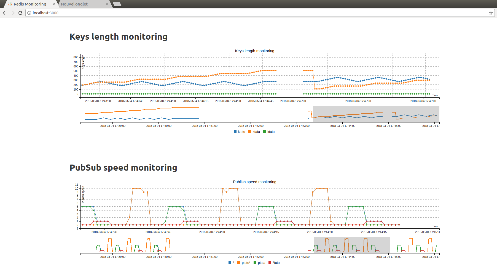

# redis-monitor

Redis-monitor is a simple monitor tools with a UI interface via Web page. Redis-monitor was design to keep track of Keys length and  Published signal frequency.


*Note: it's a side project made to learn some cpp libraries.*

## Included submodule
- [cpp_redis](https://github.com/Cylix/cpp_redis): Redis client
- [uWebSocket](https://github.com/uNetworking/uWebSockets): Websocket and http server
- [json](https://github.com/nlohmann/json): Json library
- [billboard.js (C3js fork)](https://naver.github.io/billboard.js): Chart library in js based on d3
- [cxxopts](https://github.com/jarro2783/cxxopts): Command line argument parsing
- [inja](https://github.com/pantor/inja): Template Engine similar to python Jinja
- [rocksdb](https://github.com/facebook/rocksdb): Embedded database
- [catch2](https://github.com/catchorg/Catch2): Small lib for testing
- [cpr](https://github.com/whoshuu/cpr): Python Requests in cpp (http client)

## Dependency

* uWebsocket depends on openssl
```bash
apt-get install libssl-dev
```
* redis_cpp depends on libuv
```bash
apt-get install libuv1-dev
```

## Usage example:

```bash
./redis-monitor -k ktoto -k ktata -k ktutu -s "*" -s "ptoto*" -s ptata -s "*tutu"
```

## Illustration on fake data




## Basic information

Rocks database store all processed data:
- `k + 000 + YYYY-MM-DD HH:MM:SS` : key length of the first key in command line list
- `p + 000 + YYYY-MM-DD HH:MM:SS` : # of pub per time step for the first pattern

TODO:
- Clean Test
- Add 3 letters alias for keys in command line currently key alias in database is its index in command line
- test chartjs instead of c3js. c3js failed increase memory consumption when tab is inactive or during transition (it's not optimised to realtime update)
